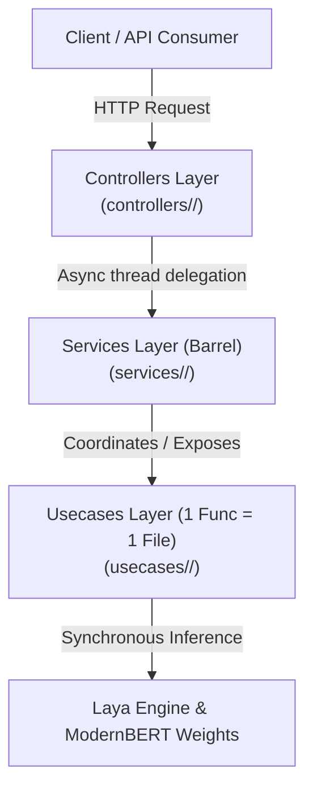

# Laya Service Architecture & Development Rules

This document outlines the architectural patterns, folder structure, layer responsibilities, and coding rules for the **Laya Decision & Routing Server**.

---

## 1. High-Level Architecture

The project follows a **Domain-Driven Clean Architecture** with strict unidirectional data flow:



### Dependency Direction Rules
* **Controllers** depend on **Services** and **Types**.
* **Services** aggregate and re-export **Usecases**.
* **Usecases** encapsulate business logic, Laya inference calls, and data transformations.
* **Usecases** NEVER depend on Controllers or FastAPI request/response constructs.

---

## 2. Directory Hierarchy

```text
laya/
├── Architecture.md                     # Architectural documentation & developer rules
├── main.py                             # FastAPI app initialization & route registration
├── test_client.py                      # Integration & in-memory test suite
│
├── controllers/                        # HTTP / API Transport Layer
│   ├── __init__.py                     # Root barrel exporting all routers
│   ├── <domain>/                       # Domain-specific endpoint folder
│   │   ├── <domain>_controller.py      # APIRouter definitions & endpoint handlers
│   │   ├── <domain>_types.py           # Pydantic schemas (Requests & Responses)
│   │   └── __init__.py                 # Router export for the domain
│
├── services/                           # Service Barrel Layer
│   ├── __init__.py                     # Root barrel exporting all services
│   ├── <domain>/                       # Domain folder matching the controller
│   │   ├── <domain>_service.py         # Barrel file bundling domain usecases
│   │   └── __init__.py                 # Service exports
│
└── usecases/                           # Pure Logic & Data Access Layer
    ├── __init__.py                     # Root barrel exporting all usecases
    └── <domain>/                       # Domain folder matching controller & service
        ├── <action>_usecase.py         # 1 Function = 1 File (Single Responsibility)
        └── __init__.py                 # Exports all usecases in this domain
```

---

## 3. Layer Responsibilities

### A. Controllers Layer (`controllers/<domain>/`)
* **Role**: Handles HTTP request parsing, status codes, query/body parameter validation, and route definitions.
* **Naming**:
  * `<domain>_controller.py`: Contains `router = APIRouter(...)`.
  * `<domain>_types.py`: Defines request/response Pydantic models (`BaseModel`).
* **Rules**:
  * **No Direct Business Logic**: Do not perform classification logic or direct model manipulations inside controllers.
  * **Non-blocking Async**: PyTorch CPU inference is blocking; always dispatch synchronous usecases to a worker thread using `await asyncio.to_thread(...)`.

### B. Services Layer (`services/<domain>/`)
* **Role**: Acts as a **barrel file / facade** for the underlying usecases of a domain.
* **Naming**:
  * `<domain>_service.py`
* **Rules**:
  * Re-exports functions from `usecases/<domain>/`.
  * If a flow requires multi-usecase orchestration, coordinate it here or delegate to an orchestrator usecase.
  * Exposes explicit `__all__` list for predictable exports.

### C. Usecases Layer (`usecases/<domain>/`)
* **Role**: Core application logic. Directly invokes the Laya router, transforms inputs, validates scoring criteria, or returns engine health.
* **Naming**:
  * `<action_name>_usecase.py` (e.g., `predict_laya_usecase.py`, `triage_ticket_usecase.py`).
* **Rules**:
  * **1 Function = 1 File**: Each file must export exactly one primary function matching the action.
  * **Framework Agnostic**: Usecases must not import `FastAPI`, `Request`, `Response`, or HTTP-specific exceptions. Return pure Python primitives (`dict`, `list`, dataclasses/Pydantic models) or raise standard Python exceptions (`ValueError`, `RuntimeError`).

---

## 4. Coding & Development Rules

### Rule 1: Naming Convention
* Use lowercase with underscores for all Python files:
  * Controller: `<domain>_controller.py`
  * Types: `<domain>_types.py`
  * Service: `<domain>_service.py`
  * Usecase: `<action_name>_usecase.py`
* Avoid dot notation in file names (e.g., `domain.controller.py`) to prevent Python module resolution conflicts.

### Rule 2: 1 Function = 1 File for Usecases
* Each usecase file contains a single focused function.
* Helper constants strictly tied to that usecase (e.g., `DEFAULT_TICKET_QUESTIONS`) may reside in the file.
* Cross-cutting helpers belong in a dedicated utility usecase (e.g., `get_laya_router_usecase.py`).

### Rule 3: Single Router Instance (Singleton)
* Never instantiate `Router()` multiple times. ModernBERT weights take ~4.4 GB RAM across all models.
* Always access the router through `get_laya_router()` in `usecases/predict/get_laya_router_usecase.py`.

### Rule 4: Startup Performance (Lazy Loading by Default)
* The server defaults to lazy loading (`preload=False`) so Uvicorn starts in `< 0.1s`.
* Preloading can be enabled in production environments by setting:
  ```env
  LAYA_PRELOAD=1
  ```

### Rule 5: Error Handling
* Usecases raise standard Python exceptions (`ValueError`, `KeyError`, `RuntimeError`).
* Controllers catch exceptions and translate them into appropriate HTTP status codes:
  * `400 Bad Request` for invalid input / malformed questions.
  * `422 Unprocessable Entity` for criteria validation issues.
  * `500 Internal Server Error` for engine failure.

---

## 5. Walkthrough: Adding a New Domain / Feature

Suppose you want to add an **Email Moderation** feature (`moderation`):

1. **Create Usecase** (`usecases/moderation/moderate_email_usecase.py`):
   ```python
   from typing import Dict, Any
   from usecases.predict.get_laya_router_usecase import get_laya_router

   def moderate_email(content: str) -> Dict[str, Any]:
       router = get_laya_router()
       # Define questions & predict
       ...
       return {"flagged": False, "score": 0.1}
   ```
   Add to `usecases/moderation/__init__.py`.

2. **Create Service Barrel** (`services/moderation/moderation_service.py`):
   ```python
   from usecases.moderation.moderate_email_usecase import moderate_email

   __all__ = ["moderate_email"]
   ```
   Add to `services/moderation/__init__.py`.

3. **Create Types** (`controllers/moderation/moderation_types.py`):
   ```python
   from pydantic import BaseModel

   class ModerationRequest(BaseModel):
       content: str

   class ModerationResponse(BaseModel):
       flagged: bool
       score: float
   ```

4. **Create Controller** (`controllers/moderation/moderation_controller.py`):
   ```python
   import asyncio
   from fastapi import APIRouter
   from controllers.moderation.moderation_types import ModerationRequest, ModerationResponse
   from services.moderation.moderation_service import moderate_email

   router = APIRouter(prefix="/moderation", tags=["Moderation"])

   @router.post("/", response_model=ModerationResponse)
   async def moderate(payload: ModerationRequest):
       return await asyncio.to_thread(moderate_email, payload.content)
   ```
   Export `router as moderation_router` in `controllers/moderation/__init__.py`.

5. **Register in `main.py`**:
   ```python
   from controllers.moderation import moderation_router
   app.include_router(moderation_router)
   ```
